# 项目名称 #
B语言解析器

# 开发环境 #
1. 所选语言：C#
2. 运行环境：VS2013
3. 运行系统：Windows10
4. 引入类：Beval
5. 项目名称：BLanguageParser
6. 可执行程序：B语言解析器

# 项目特色 #
1. 实现了B 语言大部分关键字功能
2. B语言的声明变量时无需声明变量类型，在赋值时自动判定变量的类型
3. 实现了B语言数组的基本处理
4. 良好的可视化界面，可浏览、拖拽执行文件，文件内容会同步显示在左边的文本框内
5. 本项目一大难点在于opreator函数所处理的内容十分复杂，仅仅一个操作符就要应对多种变量形式（字符串型，数值型，数组型），而opreator函数要处理的是所有的操作符号（四则运算，逻辑运算等），在此，调用了网上开源的api减少了一部分工作量。
6. 另一大难点在于if while for语句等之间的复杂嵌套，需要缜密的逻辑才编写的完善正确。
7. 计算并显示了编译时间

# 界面及功能展示 #

## 计算最大数和平均数 ##
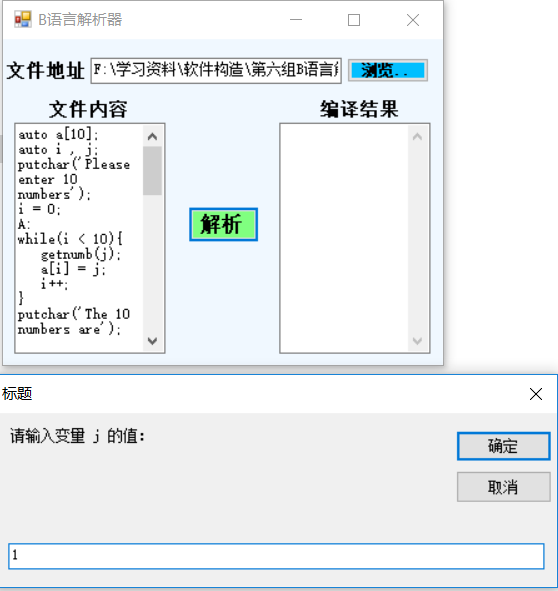

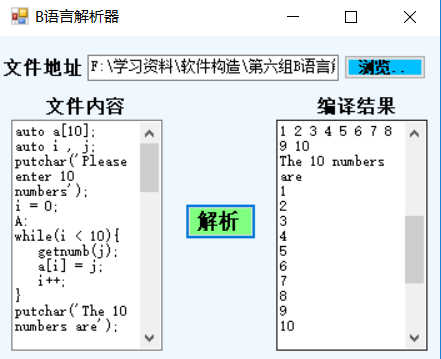

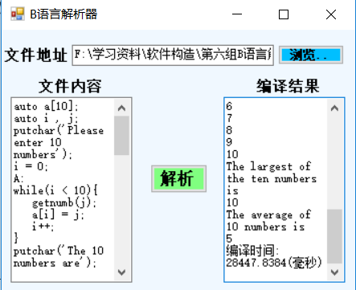

## do_while循环 ##
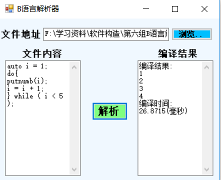

## for循环 ##
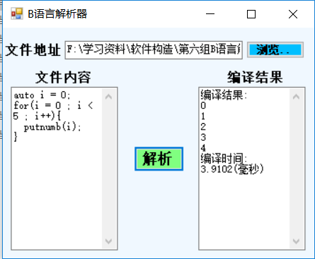

## while循环 ##
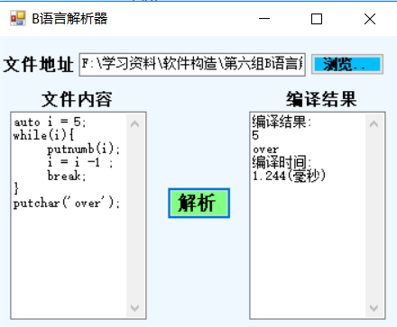

## goto语句 ##
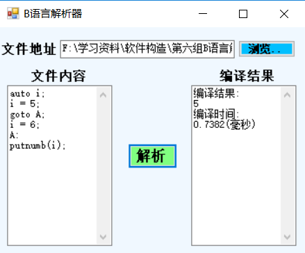

## if语句 ##
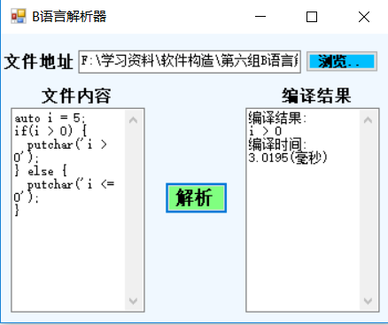

## while嵌套if ##
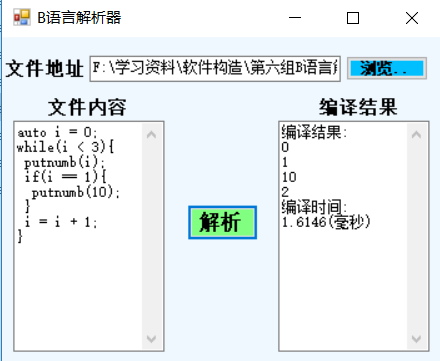

## 变量初始化及输出 ##
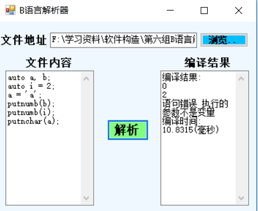

## 输入 ##
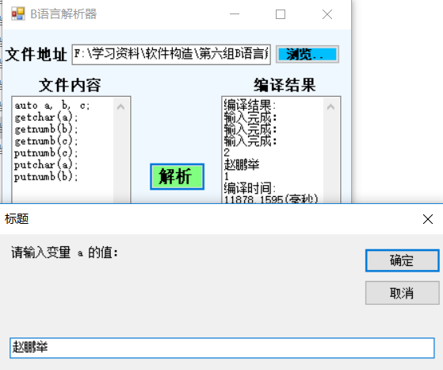

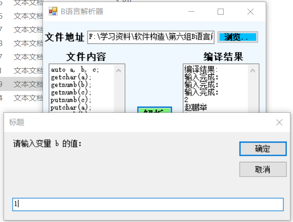
 

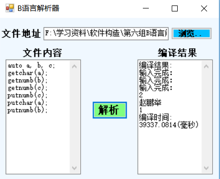

# 作者 #
段风志